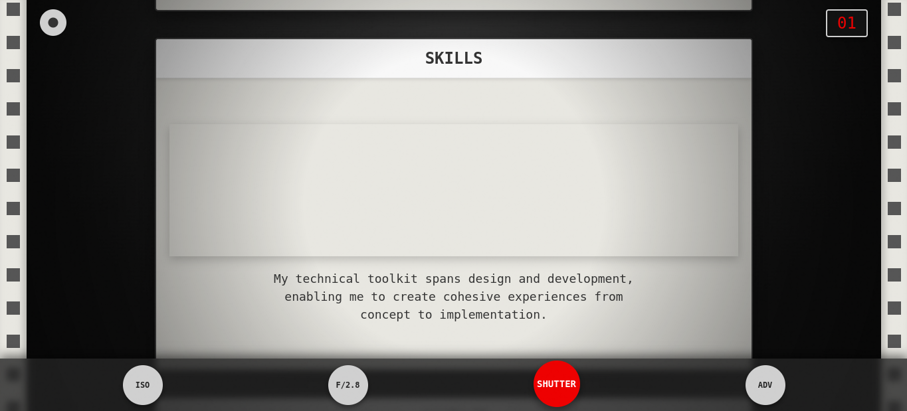

# Vintage Camera Portfolio - Template

An immersive portfolio website that simulates the interior of a vintage film camera, featuring an interactive film strip navigation system. The site combines nostalgic design elements with modern web technologies to create a unique browsing experience.

This project can also be used as a **template** for creating similar portfolio websites with unique, interactive designs.

## Features

- **Interactive Film Strip Navigation**: Scroll through portfolio items as if viewing frames on a film strip
- **Authentic Camera Details**: 
  - Sprocket holes animation
  - Film grain texture overlay
  - Frame counter display
  - Functional camera controls (ISO, Aperture, Shutter, Advance)
- **Responsive Design**: Maintains the camera aesthetic across all device sizes
- **Smooth Animations**: 
  - Film advance effects
  - Exposure flash transitions
  - Rewind functionality
- **Expandable Project Views**: Click any frame to see detailed project information
- **Accessibility**: Keyboard navigation support

## Screenshots

!| Home Page | About Section |
|:---------:|:----------:|
|  |  |

| Project Details | skills section |
|:-----------:|:--------:|
|  |  |

## Technical Implementation

Built with pure HTML, CSS, and JavaScript, featuring:
- Custom scrolling mechanics with snap points
- Dynamic frame counting system
- Simulated camera control interactions
- Responsive layout using CSS Grid and Flexbox
- CSS animations and transitions
- Mobile-optimized touch interactions

## Getting Started

1. Clone the repository
2. Open `index.html` in a modern web browser
3. Scroll through the film strip to navigate content
4. Click on frames to view detailed project information
5. Use camera controls at the bottom for additional interactions

## Browser Support

Optimized for modern browsers that support:
- CSS Grid
- Flexbox
- CSS Custom Properties
- CSS Backdrop Filter
- Smooth Scrolling API

## Performance

The site is optimized for smooth performance with:
- Efficient scroll handling
- Hardware-accelerated animations
- Optimized asset loading
- Minimal dependencies

## License

This project is open source and available under the MIT License.
